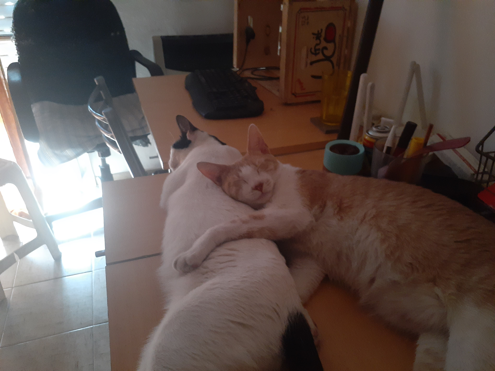

# Guido Almeida

Hola, mi nombre es **Guido**, tengo 32 años, soy estudiante de la carrera de Programación y este es mi segundo año.
Antes de decidirme por estudiar programación, cursé unos años en el profesorado de Informática, y antes de eso, unos años en el profesorado de Inglés.

Actualmente estoy trabajando de profesor de inglés en un instituto. Vivo solo en Morón, y tengo dos gatitos de 3 años.

Ellos son **Purma** y **Deimos**. Son medio inquietos pero en general se portan muy bien.

## Mis gustos

Me gusta hacer de todo en la computadora y he probado de todo un poco. Desde jugar videojuegos, hacer modelaje en 3D, editar fotos, videos y audios, mirar pelis y series. Todo lo hago con la computadora. Y ahora estoy aprendiendo a programar y me encanta!

Además, me gusta leer y escribir, coser y pintar ropa, escuchar música, entre otros, aunque últimamente no me alcanza el tiempo para estas actividades.